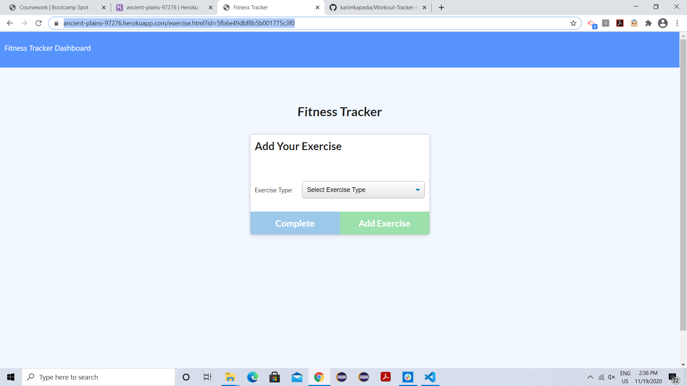
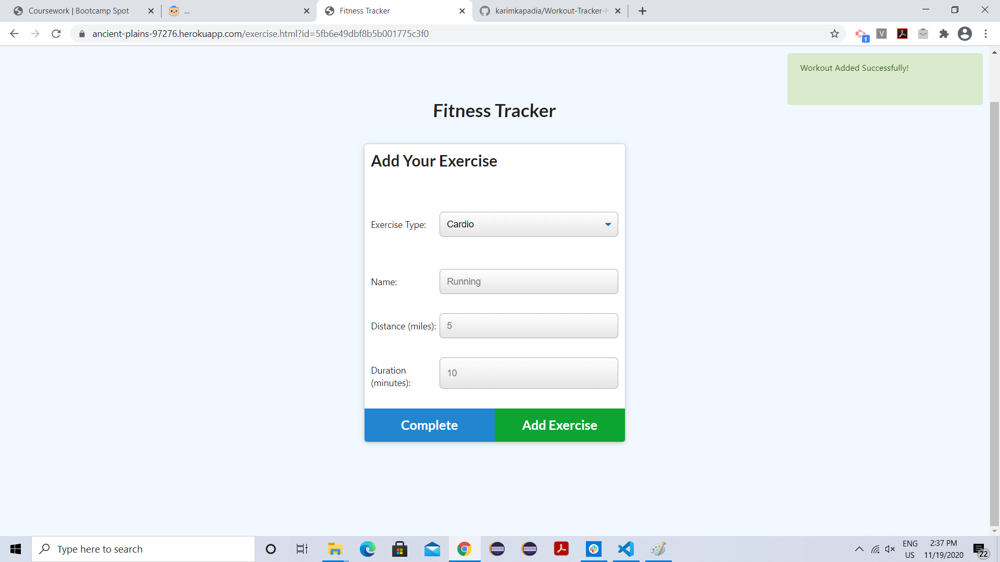
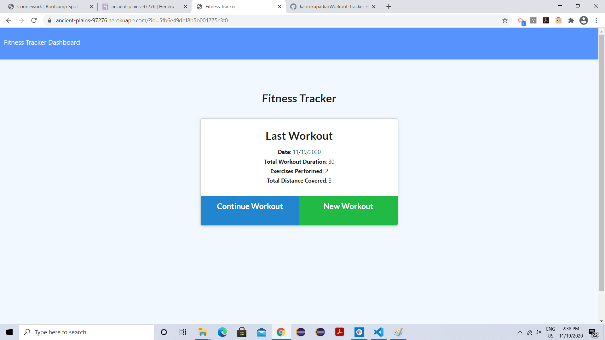
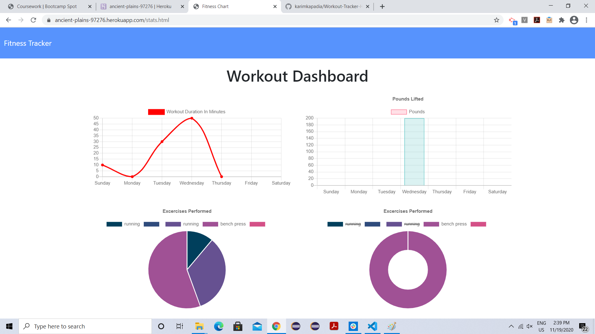

# Workout-Tracker-Homework-17
This application allows user to view, create and track daily workouts. Through this application user can log multiple exercises in a workout on a given day. User is also able to track the name, type, weight, sets, reps, and duration of exercise. If the exercise type is a cardio exercise, then user is able to track my distance traveled.

# Technologies used
HTML, CSS, Javascript, Node JS,

# Database
Mongo DB and Mongoosejs

# Images

# Links
Heroku deployed app link: https://ancient-plains-97276.herokuapp.com/exercise.html?id=5fb6e49dbf8b5b001775c3f0

Github Link: https://github.com/karimkapadia/Workout-Tracker-Homework-17